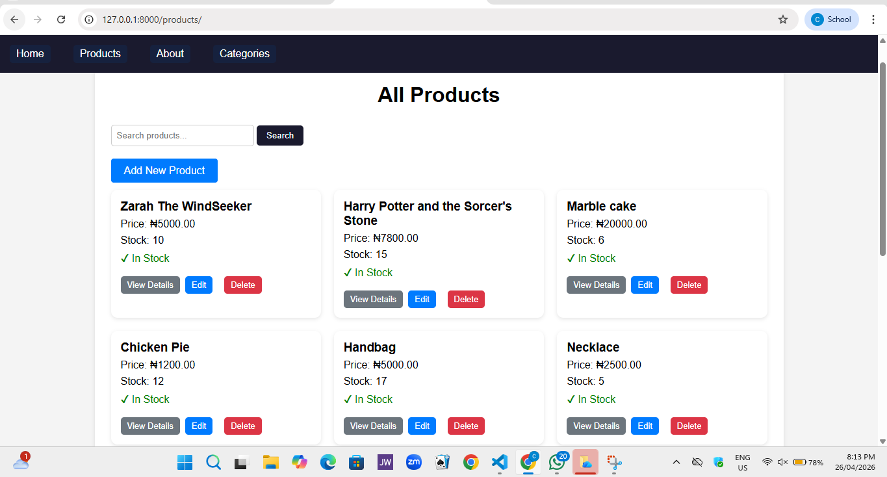
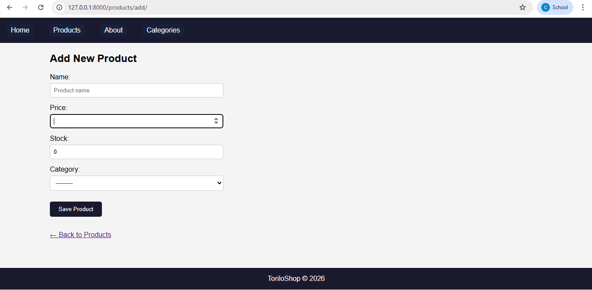
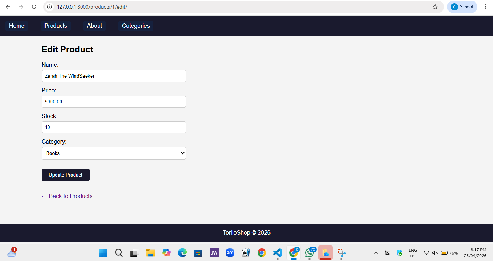
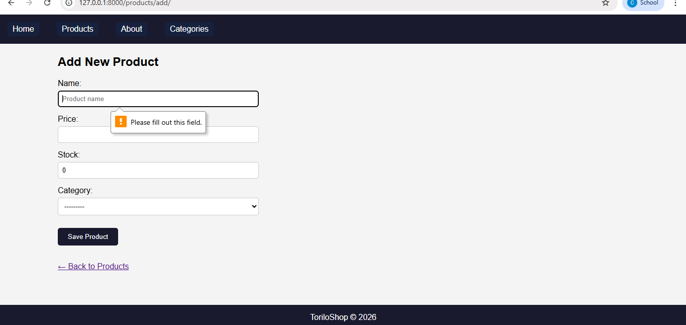
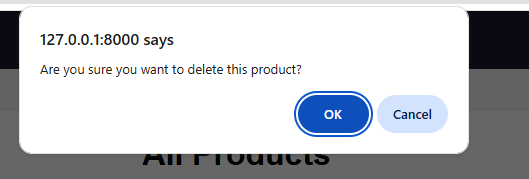
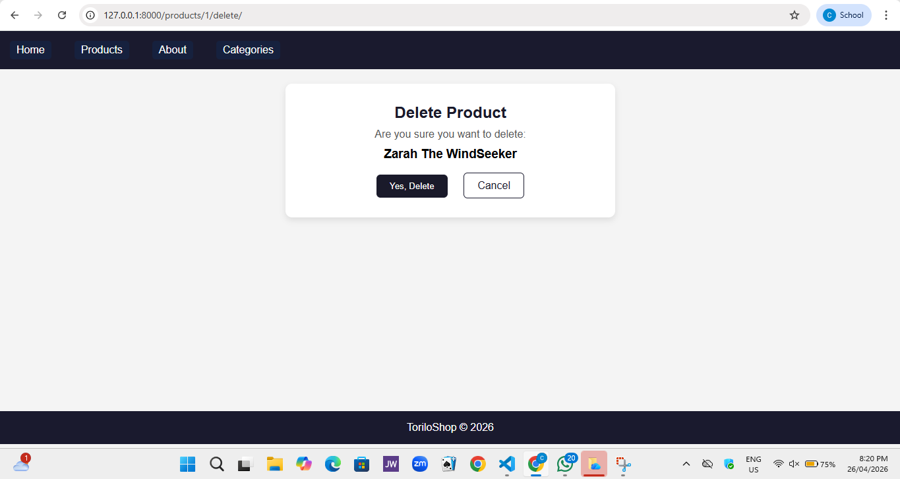
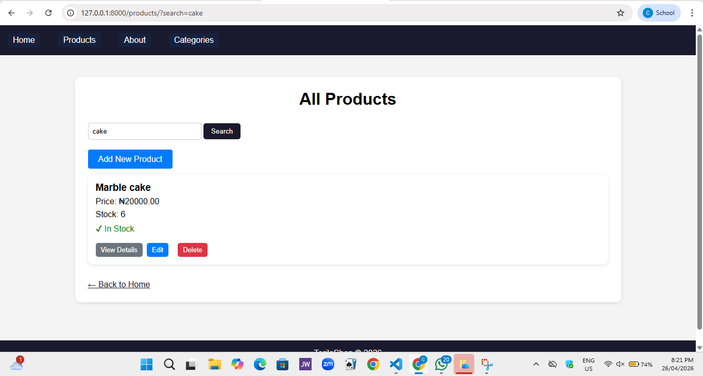
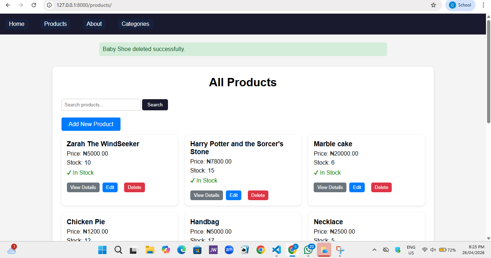

#  Module 10: Django Forms & Full CRUD

## Project Description

#### What is Toriloshop?
Torilo Shop is a simple Django web application that demonstrates how to create a django project with multiple apps, and connect URLS.
The application contains a homepage, a products page, and an about page. it also includes a custom 404 error page to handle invalid URLS and it supports database functionality using Django Models.

#### What does it do?
The application allows users to navigate between different pages such as the Home Page, Products Page, and About Page. Each page displays information using Django views.

# ToriloShop - Django CRUD Project

## Project Description

ToriloShop is a Django-based e-commerce project that allows users to manage products and categories.  
It supports full CRUD operations:

- Create products and categories
- Read (view) product and category lists
- Update product and category details
- Delete products and categories safely

It also includes:
- Search functionality for products
- Form validation
- Success messages after actions

## Features Implemented

### Product Features

- Add Product  
  URL: `/products/add/`  
  ➜ Allows users to create a new product with validation.

- View Products  
  URL: `/products/`  
  ➜ Displays all products in a grid layout.

- Edit Product  
  URL: `/products/<id>/edit/`  
  ➜ Allows updating product details using a pre-filled form.

- Delete Product  
  URL: `/products/<id>/delete/`  
  ➜ Confirms before deleting a product (POST only).

### Category Features

- Add Category  
  URL: `/categories/add/`

- View Categories  
  URL: `/categories/`

- Edit Category  
  URL: `/categories/<id>/edit/`

- Delete Category  
  URL: `/categories/<id>/delete/`

### Search Feature

- Search Products  
  URL: `/products/?search=query`  
  ➜ Filters products by name using search input.

## Setup Instructions
Follow these steps to run the project locally:

### 1. Open your terminal or command prompt using 

   C + ` (shortcut)

### 2. Navigate to the project folder:
   
   `cd/chinenye-osondu-backend-dune-cohort/module-10`

### 3. Create a virtual environment:
   
   `python -m venv venv`

### 4. Activate the virtual environment:
   
   Windows:
   
   `venv\Scripts\activate`

### 5. Install Django:
   
   `pip install django`

### 6. Run the server:
   
   `python manage.py runserver`

### 7. Open your browser and visit:
   
   `http://127.0.0.1:8000/`

**UPDATED**

### 8. Run migrations:

   `python manage.py makemigrations`

**Then Type**

   `python manage.py migrate`

### 9. Create superuser:

   `python manage.py createsuperuser`

### 10. Run the server:

   `python manage.py runserver`

### 11. Open in browser(Use this link):

   `http://127.0.0.1:8000/`

### 12. Use this to Access admin panel:

   `http://127.0.0.1:8000/admin/`

## Screenshots

### Home Page Or Welcome Page

### Product List Page

### Add Product Page

### Edit Product Page

### Form Validation Error

### Delete Pop-Up Message

### Delete Message Page

### Search Result

### Success Message

### Categories Page

## Conclusion

This project demonstrates the fundamentals of Django, including creating apps, defining views, routing URLs, and returning HTTP responses. It also introduces how to manage data using the Django admin panel It serves as a foundation for building more advanced web applications.