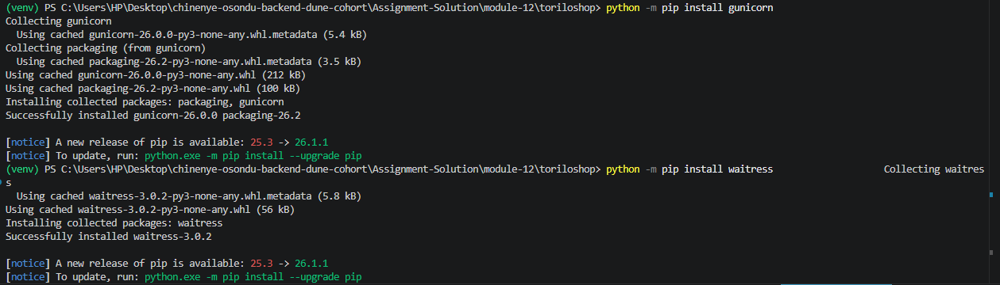
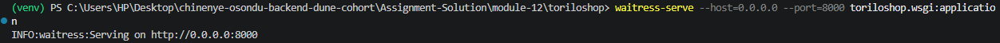
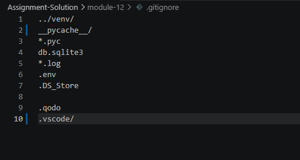
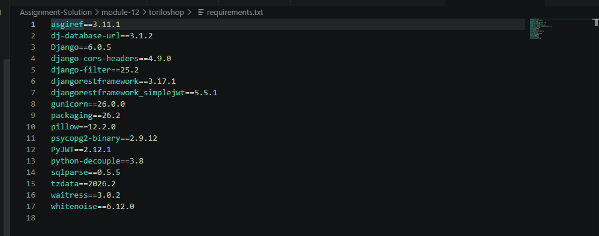
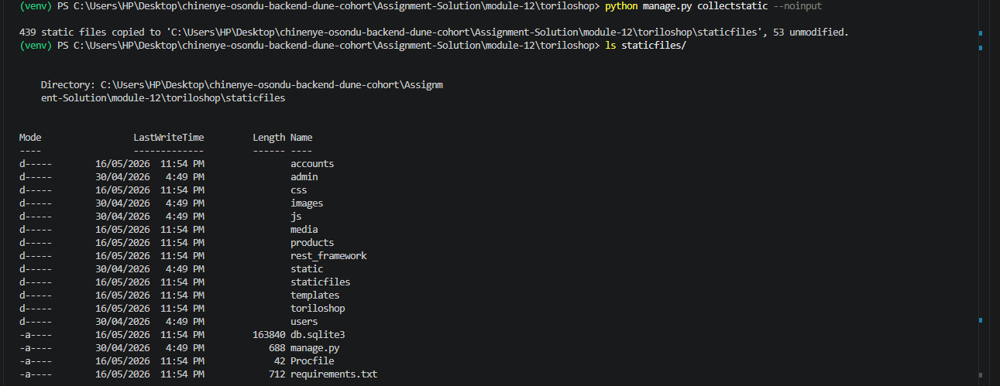
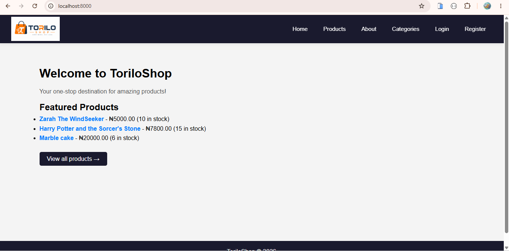

# Project Description - MOUDLE 15

## What is ToriloShop?
ToriloShop is a Django-based e-commerce web application that allows users to manage products and categories.  
The project demonstrates Django fundamentals such as models, views, templates, forms, CRUD operations, media handling, admin customization, and user authentication.

The application includes product images, custom styling, search functionality, protected routes, and permission-based access control for staff users.

ToriloShop was progressively improved from a basic CRUD web application into a secure, production-ready REST API with authentication, token-based access, JWT support, filtering, pagination, and deployment configurations.

### What does it do?
The application allows users to create, view, update, search, and manage products and categories through a functional web interface.

It supports product image uploads, customised admin features, and authentication functionalities such as registration, login, and logout.

Authenticated users can access protected product management pages, while only staff users are allowed to delete products.

The navigation bar also updates dynamically depending on whether the user is logged in or logged out.

Serve static files efficiently in production. Use environment variables for secure configuration management

### Production Changes Made to ToriloShop

ToriloShop was upgraded from a development project into a production-ready Django application.

The following production deployment improvements were implemented:

- Added `.env` configuration for sensitive environment variables
- Configured `python-decouple` for secure settings management
- Configured `dj-database-url `for flexible database configuration
- Added PostgreSQL production database support with SQLite fallback locally
- Installed `gunicorn` for production deployment suport
- Installed and configured `waitress` as the production WSGI server
- Installed and configured `whitenoise` for serving static files in production
- Configured `STATIC_ROOT` and `STATICFILES_STORAGE`
- Ran `collectstatic` for static file collection
- Added a `Procfile` for deployment platforms
- Updated `.gitignore` to exclude .env
- Generated `requirements.txt` using `pip freeze`
- Prepared the project for deployment on Render

## Features Implemented

#### ToriloShop - Django CRUD Project

## Project Description

ToriloShop is a Django-based e-commerce project that allows users to manage products and categories.  
It supports full CRUD operations:

- Create products and categories
- Read (view) product and category lists
- Update product and category details
- Delete products and categories safely

It also includes:
- Search functionality for products
- Form validation
- Success messages after actions

## Django Authentication Project

### Authentication Features

- User Registration  
  URL: `/accounts/register/`  
  ➜ Allows users to create a new account using username, email, and password.

- User Login  
  URL: `/accounts/login/`  
  ➜ Allows registered users to login securely.

- User Logout  
  URL: `/accounts/logout/`  
  ➜ Logs users out and redirects them to the homepage.

### Protected Product Features

- Protected Add Product  
  URL: `/products/add/`  
  ➜ Only logged-in users can access the add product page.

- Protected Edit Product  
  URL: `/products/<id>/edit/`  
  ➜ Only authenticated users can edit products.

- Staff Only Delete Product  
  URL: `/products/<id>/delete/`  
  ➜ Only staff users are allowed to delete products.

### Navbar Authentication Features

- Logged In Navbar  
  ➜ Displays username and logout button when user is authenticated.

- Logged Out Navbar  
  ➜ Displays login and register links when user is not authenticated.

## Django REST API Features

### Product API Endpoints

- `GET /api/products/`
  - List all products

- `POST /api/products/`
  - Create a new product

- `GET /api/products/<id>/`
  - Retrieve a single product

- `PUT /api/products/<id>/`
  - Update a product

- `DELETE /api/products/<id>/`
  - Delete a product

### Category API Endpoints

- `GET /api/categories/`
  - List all categories with related products

## Serializer Features

- ProductSerializer with nested category object
- CategorySerializer with product count field using `SerializerMethodField`

## Security Features

- Token Authentication
- JWT Authentication
- Protected API endpoints
- Only authenticated users can create products
- Only product creators can edit or delete their products
- Permission-based API access control

## API Enhancements

- Pagination with 6 products per page
- Next and previous pagination links
- Filtering by category
- Filtering by product availability
- Product search functionality
- Product ordering by price
- CORS configuration allowing frontend integration

## Production Deployment Features

- `.env `environment variable management
- `python-decouple` configuration
- `dj-database-url` database configuration
- `gunicorn` database configuration
- `waitress` WSGI production server
- `whitenoise` static file serving
- `collectstatic` support
- `Procfile` deployment configuration
- Production-ready requirements file

## Setup Instructions

Follow these steps to run the project locally:

### 1. Open your terminal or command prompt using

   C + ` (shortcut)

### 2. Navigate to the project folder:

   `cd/chinenye-osondu-backend-dune-cohort/Assignment-solution/module-12/toriloshop`

### 3. Create a virtual environment:

   `python -m venv venv`

### 4. Activate the virtual environment:

#### Windows

   `venv\Scripts\activate`

### 5. Install Django:

   `pip install django`

### 6. Install project dependencies

   `pip install -r requirements.txt`

### 7. Create a `.env` file

**Add the following variables:**

   `env - file name`

   `SECRET_KEY=your_secret_key`
   `DEBUG=True`
   `ALLOWED_HOSTS=127.0.0.1,localhost`
   `DATABASE_URL=sqlite:///db.sqlite3`

### 8. Run migrations:

   `python manage.py makemigrations`

**Then Type**

   `python manage.py migrate`

### 9. Create superuser:

   `python manage.py createsuperuser`

### 10. Collect static files

   `python manage.py collectstatic`

### 11. Run the server:

   `python manage.py runserver`

### 12. Run the application using Waitress

   `waitress-serve --host=0.0.0.0 --port=8000 toriloshop.wsgi:application`

### 13. Open in browser(Use this link):

   `http://127.0.0.1:8000/`

### 14. Use this to Access admin panel:

   `http://127.0.0.1:8000/admin/`

### API Products Endpoint

   `http://127.0.0.1:8000/api/products/`

### API Categories Endpoint

   `http://127.0.0.1:8000/api/categories/`

## Screenshots for Moudle 15

### Gunicorn Installed and Running 

###  Requirements.txt

### Requirements.txt

### CollectStatic Output

### Server Running

## Conclusion

This project demonstrates the fundamentals and advanced concepts of Django and Django REST Framework development, including models, views, templates, serializers, forms, CRUD operations, media handling, admin customization, authentication, permissions, filtering, pagination, and production deployment configuration.

The application allows users to manage products and categories, upload product images, perform search and filtering operations, access protected routes securely, and interact with REST API endpoints for product and category management.

It also demonstrates the implementation of authentication and security features such as user registration, login, logout, token authentication, JWT authentication, permission-based access control, and creator-only product editing and deletion.

Additionally, the project includes production-ready deployment configurations using environment variables, Waitress, WhiteNoise, static file handling, and deployment preparation for Render hosting.

Overall, ToriloShop serves as a strong foundation for building scalable, secure, and production-ready e-commerce web applications and REST APIs using Django and Django REST Framework.